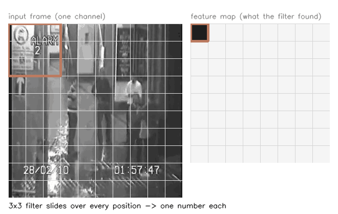
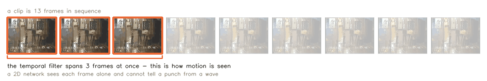
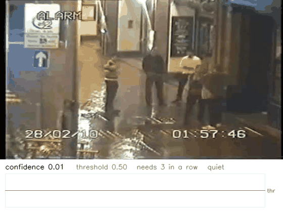
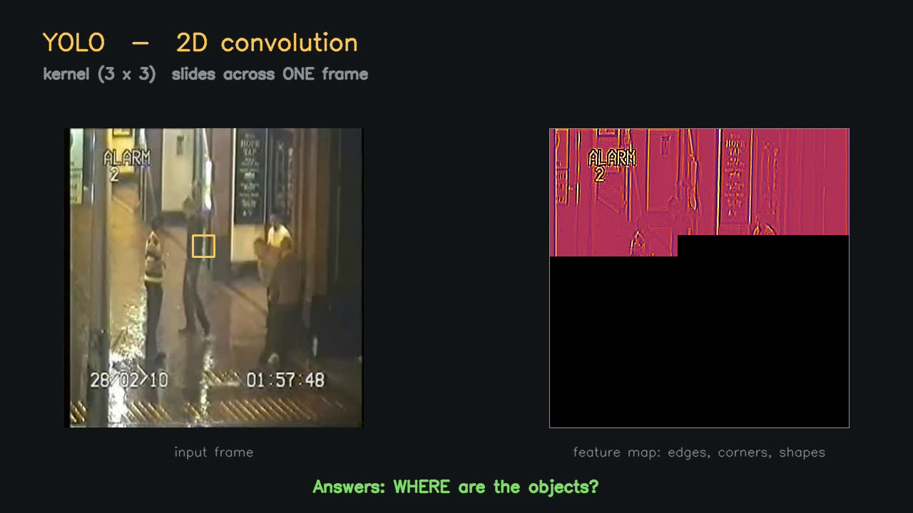
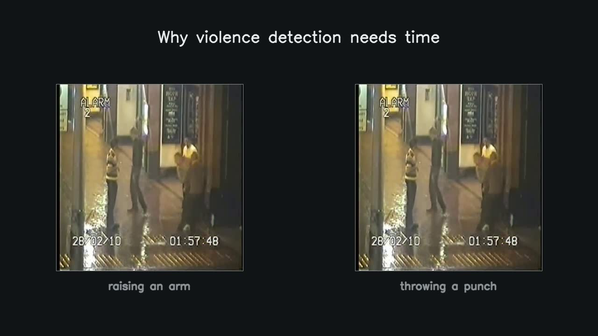
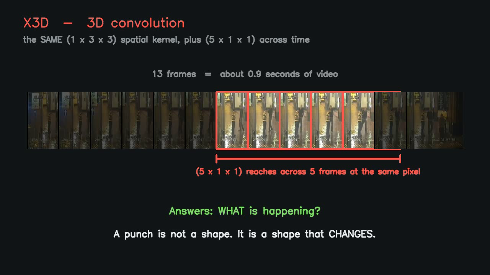
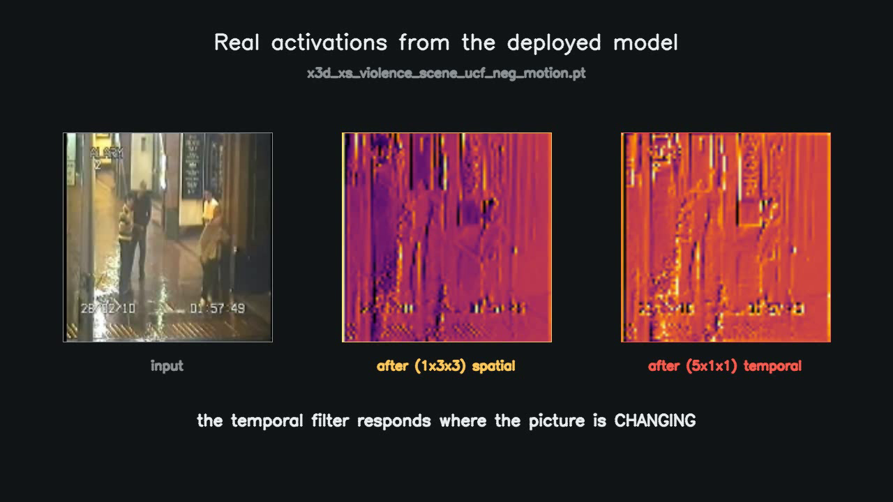

# What YOLO Does and What X3D Does

A presentation companion for the two networks in this system. Everything here
is drawn from the models actually deployed, not from a textbook example, so the
numbers quoted are the ones a reader can verify in the code.

## The video

**[`media/conv_explainer.mp4`](media/conv_explainer.mp4)** — 50 seconds,
1280×720, no audio. Built from a real CCTV fight clip in this project's dataset
and from the deployed checkpoint's own activations.

> **The script that produced this `.mp4` (`render_conv_explainer.py`) is not in
> the repository**, so the video cannot currently be regenerated. The animations
> below replace it and *can* be rebuilt at any time.

## Animations

Three GIFs, all built from the same real dataset clip and from the deployed
checkpoint. Rebuild with:

```
.venv\Scripts\python.exe tools\make_explainer_gifs.py
```

### 1. What a 2D convolution actually does



A 3×3 filter slides across every position in the frame. At each stop it
multiplies its nine weights against the nine pixels beneath it and produces
**one number**. Those numbers form the feature map on the right, which fills in
as the filter travels. This one is an edge detector, so the map brightens
wherever there is a vertical edge.

That is the whole operation. A network is this repeated — early layers find
edges, later layers find combinations of edges.

### 2. Why 3D convolution is different



The filter also reaches **across time**. It spans three frames at once, so the
number it produces describes how the picture *changed*, not what it contained.

This is the entire reason X3D is used instead of an image classifier. A 2D
network sees each frame alone, and one frame of a punch and one frame of a wave
look nearly identical. Motion is what separates them, and motion exists only
*between* frames.

### 3. What the deployed model emits



The deployed violence checkpoint running on a held-out CCTV fight clip. The
trace along the bottom is its own confidence over time, with the 0.50 threshold
marked. The red border and banner appear only once confidence has stayed above
that line for **3 consecutive** inference passes — the confirmation rule in
`_smooth_and_confirm`.

Worth watching for: confidence crosses the threshold *before* the alert fires.
That gap is the confirmation requirement doing its job, and it is what took the
system from 49 false alarms an hour to 17.

### Stills, if slides are easier than animation:

| | |
|---|---|
|  |  |
| A 3×3 kernel sliding across one frame | What YOLO returns: locations |
|  |  |
| The temporal kernel reaching across 5 frames | Real feature maps from the deployed weights |

## The one-sentence version

**YOLO asks *where*. X3D asks *what is happening*.**

## The actual structure, from the real network

X3D-XS does not use a single 3×3×3 cube. It **factorises** the 3D convolution
into two separate operations, which can be read straight out of the model:

```
x3d_xs.blocks[0]  (ResNetBasicStem)
    conv.conv_t    kernel (1, 3, 3)    stride (1, 2, 2)    24 channels
    conv.conv_xy   kernel (5, 1, 1)    stride (1, 1, 1)    24 channels
```

- `(1, 3, 3)` — **spatial only.** One frame at a time, no time extent. This is
  the same operation YOLO performs.
- `(5, 1, 1)` — **temporal only.** No spatial extent: it looks at *one pixel
  position across five consecutive frames*.

This is the most useful thing to say in a presentation, because it collapses
the apparent gap between the two models:

> **X3D is not a different kind of network from YOLO. It is YOLO's spatial
> convolution with a time axis added, and the network performs those as two
> literally separate steps.**

(The layer names read backwards — `conv_t` is the spatial one and `conv_xy` is
the temporal one. The kernel shapes are unambiguous; trust those, not the
names.)

## Why violence detection needs the time axis

A single frame cannot distinguish a raised arm from a thrown punch. The pixels
are compatible with both. What separates them is entirely in how the pixels
*change* — which is information a 2D convolution structurally cannot access,
no matter how large or how well trained.

This is why the system runs both networks rather than choosing one:

| | YOLO (2D) | X3D (3D) |
|---|---|---|
| input | 1 frame | 13 frames (~0.9 s at 30 fps) |
| kernel | 3×3 spatial | (1,3,3) spatial + (5,1,1) temporal |
| answers | where are the people | is this violent |
| output | bounding boxes, keypoints | one probability |
| cost | ~30 ms/frame at imgsz 960 | ~3.3 ms/frame amortised |

## What the activation panel actually shows

The third scene captures real feature maps by attaching forward hooks to
`conv_t` and `conv_xy` in the deployed checkpoint and averaging over the 24
output channels.

Both maps clearly outline the people — which is the honest reading. The
temporal map carries visibly more structure around the moving figures, but this
single visualisation is **suggestive, not proof** that the temporal filter is
what detects motion. A rigorous demonstration would compare activations on a
moving clip against a frozen one and show the difference is confined to the
temporal path. That experiment has not been run, and the claim should be
presented at that strength rather than stronger.

## If someone asks "why not just use YOLO for everything?"

Because pose keypoints were measured and they do not carry the signal. Four
gates built on YOLO pose output — person count, pair proximity, tracked wrist
velocity, and motion localisation inside person boxes — were each scored on 60
minutes of real Davao CCTV plus 89 violent clips. **Every one lost to simply
raising the X3D confidence threshold by 0.05.** See §27 of
[`progress_report_violence_detection.md`](progress_report_violence_detection.md).

That is a useful slide in its own right: it is a measured negative result, and
it is the reason the architecture is what it is rather than something simpler.

## Reference reading

- **X3D: Expanding Architectures for Efficient Video Recognition** —
  Feichtenhofer, CVPR 2020. The paper that introduces the model family and the
  expansion axes (frames, resolution, width, depth) this project's `x3d_xs`
  sits at the small end of.
- **SlowFast Networks for Video Recognition** — Feichtenhofer et al., ICCV
  2019. The predecessor, and the clearest statement of why temporal sampling
  rate matters for action recognition.
- **You Only Look Once: Unified, Real-Time Object Detection** — Redmon et al.,
  CVPR 2016, for the single-shot detection idea the YOLO line is built on.
- `pytorchvideo.models.hub.x3d_xs` — the exact constructor used here; reading
  `blocks[0]` in a Python shell reproduces the kernel shapes quoted above in
  about four lines.

For a general animated introduction to convolution itself, 3Blue1Brown's video
on convolutions is the usual recommendation. Search rather than trusting a URL
pasted here.

---

*Generated by `render_conv_explainer.py` (in `D:\EcoVisionImagesTraining`).
The video contains no audio; narration is expected to be live.*
